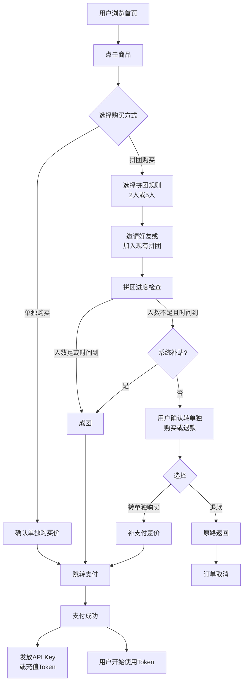
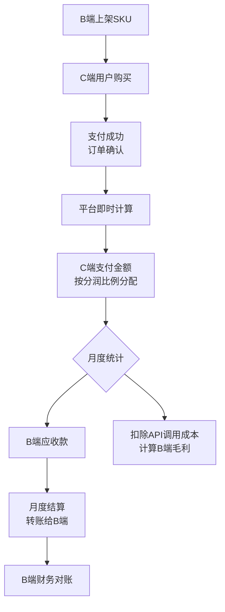

# 拼脱脱(pintuotuo) 完整产品需求规格文档

**版本**: 1.0
**最后更新**: 2026-03-14
**状态**: Draft
**维护人**: Product Team

---

## 文档说明

本文档是拼脱脱平台的完整产品需求规格文档(PRD)，阐述了平台的商业逻辑、产品设计、用户体验、技术方案和运营策略。本文档的目标受众包括：

- **产品经理**：理解完整的产品形态和业务流程
- **技术负责人**：了解系统架构、核心模块和技术选型
- **设计师**：参考用户界面设计和交互流程
- **运营团队**：理解营销策略、用户增长和商业模式

---

## 目录

1. [文档概览](#1-文档概览)
2. [产品定位与市场分析](#2-产品定位与市场分析)
3. [用户体系与分层](#3-用户体系与分层)
4. [C端核心功能](#4-c端核心功能)
5. [B端店铺系统](#5-b端店铺系统)
6. [拼团与成团机制](#6-拼团与成团机制)
7. [平台补贴与促销](#7-平台补贴与促销)
8. [API接入与Token管理](#8-api接入与token管理)
9. [商业模式与收入](#9-商业模式与收入)
10. [技术架构设计](#10-技术架构设计)
11. [运营与增长策略](#11-运营与增长策略)
12. [MVP功能划分](#12-mvp功能划分)
13. [附录](#13-附录)

---

## 1. 文档概览

### 1.1 产品简介

**拼脱脱(pintuotuo)** 是一个B2B2C的企业Token（AI算力）二级市场平台，融合了拼多多的社交裂变和自动化成团机制，为国内已购算力但利用不充分的中小企业、政府单位提供便捷的Token二级交易和共享平台。

**核心命名含义**：
- "拼"：社交拼团的核心机制
- "脱"：Token的谐音（Tuo），暗含"脱离高成本算力门槛"的价值主张
- "脱脱"：口语化、顺口好记，充满拼多多式的亲民感

### 1.2 产品愿景与使命

**愿景**：让AI算力像消费品一样普惠，让个人开发者、小型工作室、学生团队都能通过拼单享受批发价的Token。

**使命**：
- 为B端：解决获客难和库存压力，通过拼单模式快速起量
- 为C端：降低AI使用门槛，实现"消费平权"
- 为平台：建立AI算力交易的信任生态，成为AI开发者的流量聚集地

### 1.3 文档使用说明

- **章节标签**：每个设计点都附加了"拼多多采用模式"的对标标签，便于快速理解
- **数字示例**：所有描述都包含具体的数字模型，而非抽象概念
- **MVP标记**：关键功能都标注了是"MVP必做"还是"后续可选"
- **流程图**：核心业务流程用Mermaid图表或ASCII展示

### 1.4 版本日志

| 版本 | 日期 | 变更内容 |
|------|------|---------|
| 1.0 | 2026-03-14 | 初始版本，包含完整的产品、商业、技术规划 |

---

## 2. 产品定位与市场分析

### 2.1 产品定位

**产品类型**：B2B2C的企业Token二级市场 + 社交拼购平台

**目标用户**：
- **B端**：国内已购算力但利用不充分的中小企业、政府单位、研究机构
  - 如：中型SaaS公司、教育机构、智能硬件厂商
  - 特点：已有算力额度但消耗不足（如年度采购了1000万Token，只用了200万）

- **C端**：B端员工或相关开发者、AI爱好者、独立开发者、学生
  - 如：公司的技术负责人、个人创业者、在校学生
  - 特点：需要Token但成本敏感，具有社交分享意愿

### 2.2 市场机会分析

**市场空隙**：
1. **第一层**：官方API定价过高（按单位价格计费），中小企业不堪一览
2. **第二层**：现有的二级市场不规范、用户信任度低、无平台背书
3. **第三层**：缺乏"社交化"的购买体验，用户买Token像缴费般无趣

**拼脱脱的机会**：
- 通过B端入驻，汇集多个模型的API Key托管
- 通过C端的拼团和补贴，打造低价、有趣、有信任感的购买体验
- 成为"AI算力的拼多多"

### 2.3 竞争分析与差异化

| 维度 | 官方API商城 | 现有二级市场 | **拼脱脱** |
|------|-----------|-----------|---------|
| 定价 | 官方原价，无折扣 | 便宜但无保障 | 拼团折扣+平台补贴，有保障 |
| 信任度 | 很高 | 极低 | 高（平台背书+保障） |
| 用户体验 | 单调，对标银行 | 混乱，对标二手市场 | 有趣，对标拼多多 |
| 社交属性 | 无 | 无 | 强（拼团+邀请返利） |
| 模型丰富度 | 单一或少数 | 不确定 | 多个（多B端入驻） |
| 市场定位 | 面向企业和高价值用户 | 面向薅羊毛用户 | **面向普惠用户** |

---

## 3. 用户体系与分层

### 3.1 隐性分层机制（对标拼多多）

拼脱脱采用完全隐性的用户分层体系，不显示显式的"会员等级"，而是通过算法和补贴策略，形成自然的用户分化。

**分层维度**：

| 用户等级 | 消费频次 | 社交关系 | 信用评分 | 获得补贴额度 | 特殊权益 |
|---------|---------|---------|---------|-----------|---------|
| **新用户** | 首次购买 | 0-2个好友 | 系统初始值(60分) | **高** (15-20%) | 首单立减、邀请返利加倍 |
| **活跃用户** | 月消费3次+ | 5-10个好友 | 70-85分 | 中等 (5-10%) | 拼团专享、优先成团 |
| **忠诚用户** | 月消费10次+ | 10+个好友 | 85分+ | 低 (0-5%) | VIP客服、专属活动 |
| **失活用户** | 3个月无消费 | 任意 | 60分以下 | **超高** (20-25%) | 唤醒补贴、返场优惠 |

**信用评分规则**（对标拼多多的隐性信用体系）：
- 初始值：60分
- 成功拼团：+10分（每笔）
- 邀请返利：+5分（每个返利完成）
- 3个月无消费：-5分
- 投诉或纠纷：-15分
- 达到100分：可参与特殊活动（如内测新模型）

### 3.2 用户标签系统

每个用户会被贴以多维标签，用于：
- 个性化推荐（首页推荐栏）
- 精准补贴（定向发券）
- 社交匹配（推荐合适的拼单小组）

**核心标签维度**：
- **使用模型**：GPT-like、编码、视觉、多模态等
- **消费能力**：薄利多销 (0-100元/月)、中等(100-1000元/月)、高价值(1000+元/月)
- **社交活跃度**：分享型、邀请型、内向型
- **使用时段**：夜间活跃、白天活跃、不规律

### 3.3 用户成长路径

```
新用户注册
    ↓
[新用户补贴] → 首单立减 (如果购买首个Token包，自动优惠15%)
    ↓
完成首次拼团 → 邀请好友 (首次邀请返利加倍)
    ↓
成功邀请3个好友 → 升级为"活跃用户"，获得中等补贴
    ↓
月消费达到10次 → 升级为"忠诚用户"，获得VIP权益
    ↓
持续复购 → 数据积累，个性化推荐越来越精准
```

---

## 4. C端核心功能

### 4.1 首页与发现

**设计对标**：拼多多首页的信息流+分类导航

**核心页面元素**：

1. **顶部搜索与分类导航** (MVP必做)
   - 搜索框：支持模型名称、关键词搜索（如"编码"、"文本生成"）
   - 分类导航：
     - 🔥 热销爆款
     - 💰 超值拼团
     - ⏰ 限时秒杀
     - 🆕 新品上市
     - 📊 数据分析
     - 🎨 图像生成
     - 💬 文本处理

2. **信息流卡片** (MVP必做)
   - 展示格式（参考拼多多）：
     ```
     [模型图标] Kimi K2.5 编码大师包
     "已拼10万件 | ⭐ 4.8分"
     "单独购买: ¥100 → 拼团: ¥60/2人"
     [立即购买] [分享给友] [加入拼单]
     ```

   - 关键指标：
     - 已拼件数（社交证明）
     - 用户评分和评价数
     - 单独价 vs 拼团价
     - 库存提示（"仅剩10个名额"）

3. **个性化推荐栏** (MVP后续)
   - 基于用户标签的推荐
   - A/B实验测试不同排序算法
   - 露出内容：用户上次搜索的模型、常见使用时段的推荐

4. **促销运营位** (MVP必做)
   - 轮播图：当前进行的大促活动、百亿补贴、限时秒杀
   - 横幅：重点运营商品

### 4.2 商品详情页

**设计对标**：拼多多商品详情页

**核心信息架构**：

```
┌─────────────────────────────────────┐
│ 商品图片 + 基本信息                  │
│ - 模型名称、版本                    │
│ - Token数量、价格                   │
│ - 拼团人数要求、成团时间            │
└─────────────────────────────────────┘
         ↓
┌─────────────────────────────────────┐
│ 定价与优惠                          │
│ - 单独购买价：¥100                  │
│ - 拼团价格：                        │
│   • 2人成团：¥60/人 (节省40%)       │
│   • 5人成团：¥50/人 (节省50%)       │
│ - 邀请返利：邀请1人成功可返¥5       │
└─────────────────────────────────────┘
         ↓
┌─────────────────────────────────────┐
│ 商品详情                            │
│ - Token包内容：                     │
│   • 包含100万Token                  │
│   • 支持模型：GLM-5, K2.5           │
│   • 有效期：1年                     │
│   • 上下文窗口：128K                │
│ - 使用说明                          │
│ - 常见问题FAQ                       │
└─────────────────────────────────────┘
         ↓
┌─────────────────────────────────────┐
│ 评价与口碑                          │
│ - 平均评分：4.8 / 5.0              │
│ - 共1000+ 条评价                    │
│ - 最近评价展示                      │
└─────────────────────────────────────┘
```

**关键交互设计**：

1. **价格对比** (MVP必做)
   - 动态显示不同拼团人数的价格差异
   - 用红色或绿色突出节省金额
   - 示例：`单独买¥100 vs 2人拼¥60/人 (省40%)`

2. **购买方式选择** (MVP必做)
   ```
   [单独购买 ¥100]  [拼团购买]
                         ↓
                    选择拼团人数：
                    ☐ 2人成团 ¥60/人
                    ☐ 5人成团 ¥50/人
   ```

3. **分享与邀请** (MVP必做)
   - 分享按钮：微信、QQ、钉钉、企业微信
   - 邀请链接：自动生成唯一的邀请码
   - 返利提示："邀请好友成功拼团，每人可返¥5"

### 4.3 拼团流程与订单管理

#### 4.3.1 拼团发起与进度 (MVP必做)

**拼团流程**：
```
用户点击"拼团购买" → 选择拼团人数 → 选择支付方式
    ↓
支付成功 → 拼团订单生成 (订单号: PIN202603141001)
    ↓
进度展示：
  "还需1人成团，22:30前成团"
  ┌────────────────────┐
  │ 👤 你          ✓   │
  │ 👤 王小明       ✓   │
  │ 👤 缺少中...        │
  │                    │
  │ [分享给好友] [复制链接] │
  └────────────────────┘
    ↓
[情景1] 好友点击链接加入 → 成团 → 拼团价支付完成 → Token交付
[情景2] 时间到期或人数满 → 自动成团 (系统补贴差价)
[情景3] 成团失败 → 自动退款或转单独购买
```

#### 4.3.2 订单详情页 (MVP必做)

订单在"我的订单"中展示，包含：
- **订单号**：PIN202603141001
- **状态**：拼团中 / 已成团 / 已发货 / 已完成 / 已取消
- **商品信息**：模型名称、Token数量、金额
- **拼团进度**：已拼人数/总人数、成团倒计时
- **成员列表**：展示拼团小组成员（除隐私信息外）
- **操作按钮**：
  - 拼团进行中：[分享] [取消拼团]
  - 已成团：[查看Token] [开始使用] [消费明细]
  - 已完成：[评价] [再次购买]

### 4.4 Token使用与消费明细

#### 4.4.1 API Key管理 (MVP必做)

**我的Token页面**：
```
┌─────────────────────────────────┐
│ Token余额总览                   │
│ 总余额：2,500,000 Token         │
│ 本月已使用：125,000 Token       │
│ 剩余额度：2,375,000 Token       │
└─────────────────────────────────┘
         ↓
┌─────────────────────────────────┐
│ API Key列表                     │
│                                 │
│ Key #1: sk_****XXXX             │
│ 来源：Kimi K2.5 编码大师包      │
│ 创建时间：2026-02-01            │
│ 余额：1,000,000 Token           │
│ [复制Key] [禁用] [删除]         │
│                                 │
│ Key #2: sk_****YYYY             │
│ 来源：ChatGPT 学生包            │
│ 创建时间：2026-01-15            │
│ 余额：1,500,000 Token           │
│ [复制Key] [禁用] [删除]         │
└─────────────────────────────────┘
```

#### 4.4.2 消费明细 (MVP后续)

**参考设计**：手机流量消费明细，支持：
- 按日期查看消费
- 按模型查看消费
- 导出账单（PDF/Excel）
- 按钮：[下载账单] [联系客服]

示例数据表：
| 日期 | 模型 | API调用次数 | 消耗Token | 单价 | 金额 |
|------|------|-----------|---------|------|------|
| 2026-03-14 | GLM-5 | 125 | 250,000 | 0.0001 | 25 |
| 2026-03-13 | K2.5 | 60 | 120,000 | 0.0001 | 12 |

### 4.5 用户中心与账户管理

**我的个人中心**结构 (MVP必做)：

```
┌─────────────────────────────┐
│ 用户头像 + 基本信息          │
│ 等级：活跃用户              │
│ 信用评分：78分              │
└─────────────────────────────┘
         ↓
┌─────────────────────────────┐
│ 快速导航                    │
│ [我的订单] [我的Token]      │
│ [邀请好友] [我的返利]       │
│ [收藏夹] [浏览历史]         │
└─────────────────────────────┘
         ↓
┌─────────────────────────────┐
│ 账户与安全                  │
│ [账号管理] [修改密码]       │
│ [绑定邮箱] [绑定手机]       │
│ [登出]                      │
└─────────────────────────────┘
```

---

## 5. B端店铺系统

### 5.1 B端入驻与店铺开通

**流程** (MVP必做)：

```
B端企业申请入驻
    ↓
提交资料：
  • 企业营业执照
  • 法人身份信息
  • API服务说明
  • 联系方式与银行账户
    ↓
平台审核 (1-3天)
    ↓
审核通过 → 店铺激活 + API Key托管权限开放
    ↓
B端配置：
  • 上传API Key到平台保险库
  • 设置Token批发价、库存上限
  • 配置模型版本和参数限制
```

### 5.2 商品上架与定价

#### 5.2.1 SKU管理 (MVP必做)

B端可以创建多个SKU（Stock Keeping Unit），每个SKU对应一个"Token商品"。

**SKU信息字段**：
| 字段 | 说明 | 示例 |
|------|------|------|
| SKU名称 | 商品名称 | Kimi K2.5 编码大师包 |
| Token数量 | 本次销售的Token额度 | 100万 |
| 所属模型 | 支持的模型版本 | GLM-5, K2.5, K4 |
| 上下文窗口 | 模型支持的最大上下文 | 128K |
| 有效期 | Token有效期 | 1年 |
| 批发价 | B端成本价 | 0.00008元/Token |
| 建议零售价 | 单独购买价 | 100元 |
| 拼团价格 | 不同人数的拼团价 | 2人: 60元, 5人: 50元 |
| 库存上限 | 单日最多卖多少 | 1000份 |
| 开始时间 | 商品上架时间 | 2026-03-15 10:00 |
| 描述与详情 | 商品介绍 | 适合编码、API开发... |

#### 5.2.2 定价策略 (MVP必做)

B端可以在平台规则内自主定价（平台会提供定价建议和限制）：

**定价框架**：
```
B端成本价（批发价）: 0.00008元/Token
    ↓
建议零售价 = 批发价 × 1000倍 ~ 2000倍
    例如：100万Token 成本80元 → 零售价100-160元
    ↓
拼团价格 = 零售价 × 折扣率
    • 2人团：70% ~ 85%（即30% ~ 15% 折扣）
    • 5人团：50% ~ 70%（即50% ~ 30% 折扣）
```

**平台约束**：
- 拼团价不能低于 `批发价 × 1.2倍`（保证最低边际利润）
- 折扣率 > 30%（鼓励拼团）

### 5.3 B端数据看板

**看板设计** (MVP后续)：

1. **概览页面**
   - 本月销售额、成交笔数、成团率、ROI
   - 近7天销售趋势图
   - 热销Top 5商品

2. **商品管理**
   - SKU列表、销售数据、库存状态
   - 编辑、下架、复制等操作

3. **用户分析**
   - 新客占比、复购率、客单价
   - 用户地域分布、使用模型偏好

4. **财务结算**
   - 应收款、已结算金额
   - 分润明细（按天/周/月）
   - 发票管理

### 5.4 B端营销工具

**自助营销工具** (MVP后续)：

1. **满减券**
   - 如：满100元减10元、满500元减50元

2. **新客立减**
   - 如：新客首次购买本店商品自动优惠15%

3. **限时闪购**
   - B端可以设置时间段内的超低价
   - 平台会在推荐位露出

---

## 6. 拼团与成团机制

### 6.1 拼团规则与定价

**设计对标**：拼多多的阶梯团购

#### 6.1.1 成团人数与时间 (MVP必做)

每个SKU可以配置多个拼团规则：

| 拼团规则 | 成团人数 | 成团时间 | 价格 | 应用场景 |
|---------|---------|---------|------|---------|
| 2人快速团 | 2 | 2小时 | ¥60/人 | 热销爆款、普通用户 |
| 5人标准团 | 5 | 4小时 | ¥50/人 | 追求高折扣的用户 |
| 10人大团 | 10 | 6小时 | ¥45/人 | 企业批量采购(MVP后续) |

#### 6.1.2 拼团价格计算逻辑 (MVP必做)

```
步骤1：B端设定SKU
  - 零售价（单独买）：¥100
  - 批发价（成本）：¥80

步骤2：B端或平台定义折扣率
  - 2人团折扣率：60% → 每人¥60
  - 5人团折扣率：50% → 每人¥50

步骤3：实时计算拼团价
  - 如果拼团人数 < 目标人数 且时间 < 成团时间
    显示：还需X人成团，请继续邀请
  - 如果拼团人数 >= 目标人数 OR 时间到期
    自动成团，按照当前规则收费
```

### 6.2 自动成团与系统补贴

**设计对标**：拼多多的"系统补贴"保证成团率

#### 6.2.1 自动成团逻辑 (MVP必做)

当以下任一条件满足，订单自动成团：

1. **人数达到**：已拼人数 ≥ 目标人数
2. **时间到期**：距离成团时间 ≤ 0 且已拼人数 ≥ 2（最少成团人数）

**自动成团的处理**：
```
订单自动成团触发
    ↓
情景1：人数满足 (如2人团有2人)
  - 按既定拼团价收费
  - 无补贴

情景2：时间到期但人数不足 (如2人团只有1人)
  - 用户可选：
    a) 自动退款 + 返现¥5（感谢费）
    b) 转为"单独购买"，支付补差价（¥100 - ¥60 = ¥40）
  - 如果选b，平台或B端补贴差价，按单独价成交
```

#### 6.2.2 补贴机制与成团率保证 (MVP必做)

**平台补贴策略**：

| 成团场景 | 补贴方 | 补贴金额 | 成团率目标 |
|---------|--------|---------|----------|
| 拼团失败但用户愿意转单独买 | 平台或B端 | 补差价的50%~100% | 95%+ |
| 拼团失败用户退款 | 平台 | 退款 + ¥5感谢费 | 用户满意度 |
| 邀请返利 | B端分润 | 每成功邀请¥5~10 | 社交裂变激励 |

**成团率目标**：
- 目标成团率：95%+（数据显示，拼多多的自动成团保证了98%+ 的成团率）
- 成团时间：最长不超过6小时

### 6.3 社交分享与邀请

#### 6.3.1 邀请链接与追踪 (MVP必做)

**邀请机制**：

```
用户A发起拼团
    ↓
生成邀请链接：pintuotuo.com/group/PIN202603141001?uid=user_a&code=xyz123
    ↓
用户A分享给朋友（微信、QQ、钉钉等）
    ↓
朋友点击链接 → 进入"加入拼团"页面
    ↓
朋友加入拼团并支付
    ↓
系统识别邀请关系：
  - 用户A获得邀请奖励：¥5~10 Token返利
  - 或者：邀请成功可解锁"邀请返利"徽章
```

**邀请链接参数**：
- `uid`：邀请人ID
- `code`：邀请码（用于防重复、防作弊）
- `group_id`：拼团ID
- `channel`：分享渠道（微信、QQ等）

#### 6.3.2 邀请奖励与返利 (MVP必做)

**返利规则**：

1. **直接返利**
   - 邀请1人成功拼团：返¥5 Token
   - 邀请3人成功拼团：返¥20 Token + 升级为"活跃用户"
   - 邀请10人成功拼团：返¥100 Token + VIP权益

2. **间接返利（推荐关系链）**(MVP后续)
   - 通过用户A邀请的用户B，再邀请用户C
   - 用户A可获得额外返利（金额更小，如¥1）

#### 6.3.3 防作弊机制 (MVP必做)

**检测与限制**：
- 同一设备、IP不能多次邀请自己
- 邀请链接7天内有效
- 邀请过多（如一人邀请100+）会被标记为异常，冻结返利
- 黑名单管理：已作弊用户无法发起邀请

### 6.4 拼团失败与退款处理

**拼团失败流程** (MVP必做)：

```
拼团进度：缺少2人，时间已到期
    ↓
系统自动触发失败处理
    ↓
    ↙               ↘
B端补贴          B端不补贴
    ↓               ↓
用户可选：      用户只能选择：
1. 支付补差价    1. 取消拼团，全额退款
2. 转入其他拼单   2. 转入下一个拼团
3. 取消退款
    ↓
后续处理：邮件通知用户，提供各选项按钮
```

**退款处理**：
- 退款周期：24小时内
- 退款方式：原路返回
- 如果是平台补贴的"失败补贴"，直接转为平台余额（无需提现）

---

## 7. 平台补贴与促销

### 7.1 百亿Token补贴与营销策略

**设计对标**：拼多多的"百亿补贴"

#### 7.1.1 补贴额度与申请 (MVP后续)

**补贴目标**：
- 打出"全网低价"的口号
- 专注于热销、刚需的模型
- 驱动新用户首购

**补贴形式**：

| 补贴类型 | 额度 | 适用场景 | 成本 |
|---------|------|---------|------|
| 首单立减 | ¥15~20 | 新用户首次购买 | 固定成本 |
| 拼团补贴 | 补差价的50% | 拼团失败转单独买 | 浮动成本 |
| 邀请返利 | ¥5~10/人 | 邀请新用户成功拼团 | 可控成本 |
| 秒杀补贴 | ¥10~50 | 限时秒杀活动 | 营销成本 |

**申请流程**（B端角度）：
- B端在后台申请补贴活动
- 平台评估商品热度、成本、ROI
- 通过审核 → 展示在"百亿补贴"栏目

### 7.2 限时秒杀与活动

**活动类型** (MVP后续)：

#### 7.2.1 限时秒杀
- 时间段：如每天 10:00 ~ 12:00
- 价格：比拼团价低20%~30%
- 库存：有限（如仅100份）
- 展示：顶部运营位、App通知推送

#### 7.2.2 夜间特惠
- 面向深夜活跃的开发者
- 时间：22:00 ~ 06:00
- 折扣：夜间订单统一9折

#### 7.2.3 周五大促
- 每周五发起的综合大促
- 多个模型参与、多档位补贴
- 营造"逛街"的节日感

### 7.3 营销预算与成本控制

**月度预算框架** (MVP后续)：

假设月GMV目标：1000万元
```
营销补贴总预算：200万元 (20% ROI目标)

分配方案：
  ├─ 新用户补贴：50万 (首单立减)
  ├─ 拼团补贴：80万 (失败转单独)
  ├─ 邀请返利：40万 (社交裂变)
  ├─ 秒杀活动：20万 (热销爆款)
  └─ 预备金：10万 (突发运营需求)

成本控制：
  • 单个用户平均补贴 < 50元
  • LTV (Lifetime Value) / CAC (Customer Acquisition Cost) > 3:1
  • 留存率 > 30% (用户补贴后的复购率)
```

---

## 8. API接入与Token管理

### 8.1 API Key托管架构

**设计对标**：云服务的API密钥管理

#### 8.1.1 密钥存储与安全 (MVP必做)

**架构设计**：
```
┌─────────────┐
│  B端商户    │
│ 上传API Key  │
└──────┬──────┘
       │
       ↓
┌──────────────────────────┐
│  拼脱脱平台中央密钥库    │
│                          │
│ ┌────────────────────┐   │
│ │ 密钥加密存储       │   │
│ │ • AES-256加密      │   │
│ │ • HSM硬件安全模块  │   │
│ │ • 定期轮换         │   │
│ └────────────────────┘   │
│                          │
│ ┌────────────────────┐   │
│ │ 访问控制           │   │
│ │ • 仅API网关可访问  │   │
│ │ • 操作日志审计     │   │
│ │ • IP白名单限制     │   │
│ └────────────────────┘   │
└──────┬───────────────────┘
       │
       ↓
┌─────────────────┐
│  API网关/路由层  │
│ 调用B端API      │
└─────────────────┘
```

#### 8.1.2 密钥管理操作 (MVP必做)

**B端可执行的操作**：

```
我的API Keys
├─ [+ 新增密钥]
├─ Key #1: sk_****XXXX (Kimi API)
│  ├─ 状态：活跃
│  ├─ 月度额度：1000万Token
│  ├─ 已消耗：125万Token (12.5%)
│  ├─ 操作：[编辑配额] [禁用] [删除]
└─ Key #2: sk_****YYYY (GPT API)
   ├─ 状态：禁用
   ├─ 操作：[启用] [删除]
```

**配额管理**：
- B端可以设置月度额度上限
- 可以按需增加或减少额度
- 超额消耗需要B端的警告通知

### 8.2 实时计费与余额扣费

#### 8.2.1 计费流程 (MVP必做)

**扣费时机**：

```
C端用户调用API
    ↓
请求到达API网关
    ↓
平台识别：
  ├─ 用户ID
  ├─ 模型名称 (如GLM-5)
  ├─ Token消耗量 (如输入2000 tokens + 输出500 tokens)
  └─ API Key来源 (来自哪个B端店铺)
    ↓
实时计费：
  • 调用价格 = 模型单价 × 消耗tokens数
  • 如：GLM-5单价 0.0001元/token，消耗2500tokens = ¥0.25
    ↓
扣除用户余额 → 加入B端营收 → 计算佣金
    ↓
异步记录：消费明细日志
```

#### 8.2.2 计费单价管理 (MVP必做)

**定价表维护**：

| 模型 | 输入Token单价 | 输出Token单价 | B端成本 | 平台分润 |
|------|-------------|-------------|--------|---------|
| GLM-5 | 0.0001 | 0.0001 | 0.00005 | 50% |
| K2.5 | 0.00008 | 0.0001 | 0.000035 | 60% |
| GPT-3.5 | 0.0015 | 0.002 | 0.0008 | 47% |

**灵活定价**：
- B端可以在平台规则内调整单价
- 平台规则：B端定价 ≥ 成本价 × 1.5倍
- 动态定价：基于库存、需求等调整（MVP后续）

### 8.3 多模型支持与路由

#### 8.3.1 模型库与版本管理 (MVP必做)

**模型库结构**：
```
平台管理的模型库

智谱模型
├─ GLM-5
│  ├─ 版本：20250315
│  ├─ 上下文窗口：128K
│  ├─ 支持功能：文本、编码、数据分析
│  └─ API端点：https://api.zhipu.ai/v4/chat/completions
├─ GLM-Janus (多模态)
│  └─ ...
└─ K-Chat

Kimi/Moonshot
├─ K2.5
├─ K3
└─ K4

其他模型
├─ Claude (via Anthropic API)
├─ Grok (via xAI)
└─ ...
```

#### 8.3.2 API路由与负载均衡 (MVP必做)

**路由逻辑**：

```
用户请求API
    ↓
识别用户购买的模型 (如 GLM-5)
    ↓
查询该模型的可用Key列表
    ↓
负载均衡算法：
  ├─ 轮询：Key1 → Key2 → Key3 ...
  ├─ 最少连接：选择当前连接数最少的Key
  └─ 加权轮询：根据Key的"健康度"加权
    ↓
调用对应的Key发送请求
    ↓
响应返回给用户，同时记录消费
```

**容错机制**：
- 如果Key达到配额，自动切换到下一个Key
- 如果所有Key都无可用额度，返回友好的错误提示："您的Token已用完，请购买更多"

---

## 9. 商业模式与收入

### 9.1 收入结构与分润模式

**设计对标**：淘宝、拼多多的"平台抽佣"模式

#### 9.1.1 分润规则 (MVP必做)

**分润公式**：

```
C端用户支付金额：¥100

分配流程：
  C端支付¥100
    ↓
  平台保留佣金：¥100 × 30% = ¥30（可以是25-40%，具体由合约确定）
    ↓
  B端得到：¥100 × 70% = ¥70
    ↓
  B端成本 (API调用): 该¥100对应消耗的实际API成本，如¥40
    ↓
  B端毛利：¥70 - ¥40 = ¥30
```

**分润比例建议**：
- 热销/热门模型：平台取30%（或更低，吸引B端入驻）
- 普通模型：平台取35%
- 冷启动期特殊模型：平台取25%（激励）

#### 9.1.2 实际收益示例

**月度收益预测** (假设前12个月的目标)：

```
第1个月：
  GMV (总销售额)：100万元
    平台收入：30万元 (30% 佣金)
    平台支出：补贴 + 服务器 + 人工 ≈ 45万元
    净利润：-15万元 (投入期)

第6个月：
  GMV：1000万元
    平台收入：300万元
    平台支出：补贴100万 + 成本80万 = 180万元
    净利润：120万元

第12个月：
  GMV：5000万元
    平台收入：1500万元
    平台支出：补贴300万 + 成本200万 = 500万元
    净利润：1000万元

年度预测：平台全年净利润 ≈ 3000-5000万元
```

### 9.2 成本结构

**主要成本项** (MVP必做)：

| 成本项 | 月度预算 | 说明 |
|--------|----------|------|
| 用户补贴 | 200万 | 首单立减、拼团补贴、返利等 |
| 基础设施 | 50万 | 服务器、CDN、数据库等 |
| 人力成本 | 150万 | 技术、产品、运营、客服 |
| 营销推广 | 100万 | 品牌宣传、流量采购 |
| 其他成本 | 50万 | 支付手续费、法务等 |
| **合计** | **550万** | |

**盈利目标**：
- 第6个月：接近盈亏平衡（GMV ≥ 2000万）
- 第12个月：实现较好利润（利润率 > 20%）

### 9.3 风险防控与合规

**重点风险** (MVP必做)：

#### 9.3.1 商业风险

1. **B端Key失效或额度不足**
   - 控制：建立Key的"健康检查"机制，定期测试每个Key
   - 备选：为热门模型维护多个备用Key

2. **C端用户作弊**
   - 控制：邀请防刷、IP识别、异常检测
   - 后果：冻结账户、黑名单

3. **拼团失败导致的高补贴成本**
   - 控制：优化拼团配置（人数、时间），提高成团率
   - 预案：动态调整补贴力度

#### 9.3.2 合规风险

1. **支付合规**
   - 对接正规支付渠道（支付宝、微信支付、银联）
   - 定期财务审计

2. **API合规**
   - 确保B端API Key的合法性
   - 用户协议明确API Key不转让、不共享

3. **数据隐私**
   - 用户数据加密存储
   - 符合GDPR、中国个人信息保护法

---

## 10. 技术架构设计

### 10.1 系统架构概览

**分层架构** (MVP必做)：

```
┌────────────────────────────────────────────┐
│          API Gateway / 网关层              │
│  • 请求路由                              │
│  • 认证授权                              │
│  • 限流、防刷                            │
└──────────────┬─────────────────────────────┘
               │
    ┌──────────┼──────────┬──────────┐
    ↓          ↓          ↓          ↓
┌────────┐ ┌────────┐ ┌────────┐ ┌────────┐
│  C端    │ │  B端    │ │ 支付    │ │  公共  │
│ 服务    │ │ 服务    │ │ 服务    │ │ 服务  │
└────────┘ └────────┘ └────────┘ └────────┘
    ↓          ↓          ↓          ↓
┌────────────────────────────────────────────┐
│          业务逻辑层 / Service Layer         │
│  • 订单服务          • 拼团服务           │
│  • Token服务         • 用户服务           │
│  • 计费引擎          • 推荐引擎           │
│  • 营销引擎          • 风控引擎           │
└──────────────┬─────────────────────────────┘
               │
    ┌──────────┼──────────┬──────────┐
    ↓          ↓          ↓          ↓
┌────────┐ ┌────────┐ ┌────────┐ ┌────────┐
│ 数据   │ │ 缓存   │ │ 消息   │ │ 文件  │
│ 库     │ │(Redis)│ │队列    │ │存储  │
└────────┘ └────────┘ └────────┘ └────────┘
```

### 10.2 核心模块与职责

**关键模块划分** (MVP必做)：

| 模块 | 职责 | 依赖 |
|------|------|------|
| **订单服务** | 订单创建、支付、状态管理 | 支付服务、库存服务 |
| **拼团服务** | 拼团逻辑、成团判断、自动成团 | 订单服务、Redis |
| **Token服务** | Token购买、消费、余额管理 | 计费引擎、数据库 |
| **计费引擎** | 实时扣费、消费记录、单价计算 | Token服务、审计日志 |
| **用户服务** | 注册、登录、个人中心、信用评分 | 身份认证、数据库 |
| **推荐引擎** | 首页推荐、个性化商品排序 | 用户标签、行为数据 |
| **支付服务** | 支付渠道对接、结果回调、对账 | 第三方支付API |
| **API网关** | 模型路由、Key管理、限流 | 密钥库、负载均衡 |
| **风控引擎** | 异常检测、防作弊、黑名单 | 用户行为、IP数据库 |
| **消息服务** | 订单通知、拼团提醒、营销推送 | Kafka、邮件/短信服务 |

### 10.3 数据流与关键路径

#### 10.3.1 用户购买Token的完整流程 (MVP必做)

```
[用户选择商品]
    ↓
[选择购买方式：单独/拼团]
    ↓
[创建订单] → 订单服务 → 保存DB
    ↓
[支付流程]
  ├─ 调用支付网关 → 支付宝/微信
  ├─ 等待支付结果回调
  └─ 支付成功 → 更新订单状态
    ↓
[Token分配]
  ├─ 如果是单独买：直接分配API Key或充值Token
  ├─ 如果是拼团：检查是否成团
  │  ├─ 已成团：分配API Key
  │  └─ 未成团：进入拼团等待队列
    ↓
[生成消费记录]
  • 记录用户购买的Token数量、价格、来源模型
  • 异步写入分析数据仓库
    ↓
[发送通知]
  • 邮件/App通知：订单确认
  • 对B端：销售额实时更新
    ↓
[用户开始使用Token]
```

#### 10.3.2 用户调用API消耗Token的完整流程 (MVP必做)

```
[用户调用API]
  GET/POST https://api.pintuotuo.com/v1/chat/completions
  Headers: Authorization: Bearer sk_****XXXX
    ↓
[API网关处理]
  ├─ 验证Token (sk_****XXXX)
  ├─ 识别用户和模型
  ├─ 检查用户余额是否充足
  └─ 风控检查（QPS限流、异常行为）
    ↓
[路由到对应的B端API]
  ├─ 查询用户购买的API Key列表
  ├─ 负载均衡选择Key
  └─ 转发请求到B端模型API
    ↓
[B端API返回结果]
  ├─ 统计消耗的Token数量
  ├─ 根据单价计算费用
  └─ 返回结果给用户
    ↓
[实时计费]
  消耗Token = 输入tokens + 输出tokens
  费用 = 消耗Token × 单价
  扣除用户账户余额
    ↓
[异步处理]
  ├─ 记录消费明细日志
  ├─ 更新用户余额缓存
  ├─ 触发余额预警（余额 < 阈值）
  ├─ 累计B端营收（用于月度结算）
  └─ 计算平台佣金
    ↓
[用户实时看到的结果]
  • 消费记录实时显示
  • 余额实时更新
```

### 10.4 关键技术指标与性能要求

**性能目标** (MVP必做)：

| 指标 | 目标 | 说明 |
|------|------|------|
| API响应时间 | < 100ms (P99) | 用户调用API的延迟 |
| 订单创建延迟 | < 500ms | 用户点击支付到订单创建 |
| 拼团成团判断 | < 50ms | 实时判断是否成团 |
| 首页加载时间 | < 2s | C端首页加载 |
| 并发支持 | 10,000+ QPS | 秒杀等高并发场景 |
| 可用性 | 99.9% | 系统月度可用性目标 |

**缓存策略** (MVP必做)：

```
Redis缓存多层级：

L1: 用户余额缓存
  • Key: user:{user_id}:balance
  • TTL: 实时更新
  • 用途：快速查询用户Token余额

L2: 拼团进度缓存
  • Key: group:{group_id}:progress
  • TTL: 5分钟或手动更新
  • 用途：显示"还需X人成团"

L3: 模型单价缓存
  • Key: model:{model_name}:price
  • TTL: 1小时
  • 用途：快速计费

L4: 热点商品缓存
  • Key: product:{sku_id}:info
  • TTL: 5分钟
  • 用途：首页推荐的实时库存、已拼数量
```

### 10.5 消息队列与异步处理

**异步任务队列** (MVP必做)：

使用Kafka处理高并发场景：

```
核心异步任务：

1. 订单通知
   • 用户订单支付成功 → 发送邮件/短信/App推送
   • 拼团成功通知 → 所有参团者收到通知

2. 消费记录
   • 每次API调用后，异步记录消费明细
   • 批量写入数据库（减轻实时写入压力）

3. 佣金计算
   • 月度汇总B端销售额 → 计算平台分润
   • 异步触发财务对账

4. 用户补贴
   • 识别符合条件的用户 → 发放补贴
   • 如：新用户首单立减、邀请返利

5. 风控检测
   • 实时分析用户行为 → 检测异常
   • 如：短时间内多个不同IP的邀请 → 标记为作弊
```

---

## 11. 运营与增长策略

### 11.1 冷启动策略 (MVP后续)

**第一阶段：邀请期（Week 1-2）**

目标：获得1000个种子用户

- 邀请制注册，保证优质用户
- 早期用户获得最高补贴（首单立减¥30）
- 建立用户微信群或Discord社区

**第二阶段：公测期（Week 3-8）**

目标：获得10万用户，GMV ≥ 200万

- 扩大邀请范围，社交媒体宣传
- 与AI社区KOL合作推广
- 首单补贴力度保持¥20

**第三阶段：正式上线（Month 3+）**

目标：持续增长，每月新增30%+

- App Store、应用商店上线
- 搜索引擎和内容营销
- B端商家自发传播

### 11.2 用户增长引擎

**拉新渠道** (MVP后续)：

1. **社交裂变** (核心渠道)
   - 邀请返利激励用户主动分享
   - 目标：1/3的新用户来自老用户邀请

2. **内容营销**
   - 小红书、知乎、B站的AI开发教程
   - 植入拼脱脱的使用场景

3. **KOL合作**
   - 与AI社区的知名博主合作
   - 如：AI编程、ChatGPT使用教程等领域的头部账号

4. **品牌广告** (后期)
   - 地铁、综合资讯App的品牌曝光

**留存策略**：

| 留存阶段 | 时间 | 策略 | 指标 |
|---------|------|------|------|
| Day-1留存 | 下单后24小时 | 邮件/推送感谢，邀请赚返利 | > 40% |
| Day-7留存 | 下单后7天 | 推荐适合的Token包，限时优惠 | > 20% |
| Day-30留存 | 下单后30天 | 会话激励，邀请返利到账 | > 10% |

### 11.3 B端拓展与商家运营 (MVP后续)

**B端入驻目标**：

| 阶段 | 时间 | 商家数 | 目标 |
|------|------|--------|------|
| MVP | Month 1-2 | 3-5 | 证明商业模式可行 |
| 初期 | Month 3-6 | 10-20 | 丰富模型选择 |
| 增长期 | Month 7-12 | 50+ | 成为"AI Model Hub" |

**B端激励**：
- 早期商家减免手续费（或降低到20%）
- 数据看板、营销工具优先开放
- 专属客服运营

### 11.4 品牌推广与公关

**品牌定位**：
- 产品定位：AI算力的"拼多多"
- 核心卖点：低价、社交、有趣
- 品牌个性：年轻、亲民、敢说敢做

**内容主题** (MVP后续)：
- "Token怎么买最便宜？"
- "一个人买不起的AI，5个人拼起来只要几块钱"
- "邀请3个朋友拼团，比官方便宜50%"

---

## 12. MVP功能划分

### 12.1 MVP必做功能（第一版，6-8周）

**核心目标**：建立完整的交易闭环，支持用户拼团购买Token并使用

#### 12.1.1 C端功能 (MVP必做)

| 功能 | 描述 | 优先级 |
|------|------|--------|
| 用户注册/登录 | 邮箱或手机号注册 | 🔴 P0 |
| 首页展示 | 商品信息流、分类导航、搜索 | 🔴 P0 |
| 商品详情页 | 价格、拼团规则、详情、评价 | 🔴 P0 |
| 单独购买 | 一键下单、支付、订单管理 | 🔴 P0 |
| 拼团购买 | 发起拼团、加入拼团、成团判断 | 🔴 P0 |
| 拼团进度 | 显示还需X人，成团倒计时 | 🔴 P0 |
| 分享邀请 | 生成邀请链接，邀请返利 | 🔴 P0 |
| 我的订单 | 订单列表、状态、操作 | 🔴 P0 |
| 我的Token | API Key展示、余额查询 | 🔴 P0 |
| 个人中心 | 基本信息、等级、账户管理 | 🟡 P1 |
| 消费明细 | 消费记录、消费详情 | 🟡 P1 |

#### 12.1.2 B端功能 (MVP必做)

| 功能 | 描述 | 优先级 |
|------|------|--------|
| 商家注册 | 营业执照认证、资料填写 | 🔴 P0 |
| 店铺管理 | 基本信息、头像、简介 | 🔴 P0 |
| API Key上传 | 密钥托管、配额设置 | 🔴 P0 |
| SKU管理 | 新增商品、编辑定价、上下架 | 🔴 P0 |
| 销售数据 | 实时销售额、成交笔数、成团率 | 🟡 P1 |
| 订单管理 | 查看订单、核对金额 | 🟡 P1 |
| 结算管理 | 应收款、月度分润明细 | 🟡 P1 |

#### 12.1.3 平台功能 (MVP必做)

| 功能 | 描述 | 优先级 |
|------|------|--------|
| 支付对接 | 支付宝、微信支付集成 | 🔴 P0 |
| 订单系统 | 订单创建、支付、状态管理 | 🔴 P0 |
| 拼团引擎 | 拼团逻辑、成团判断、自动成团 | 🔴 P0 |
| 计费引擎 | Token扣费、消费记录 | 🔴 P0 |
| API路由 | 请求转发、Key管理、负载均衡 | 🔴 P0 |
| 用户认证 | 登录授权、Token验证 | 🔴 P0 |
| 风控系统 | 基础防刷、异常检测 | 🟠 P2 |
| 消息通知 | 邮件、App推送 | 🟡 P1 |

### 12.2 后续优化功能（第二版及以后）

**不在MVP中的功能**：

| 功能 | 预计上线时间 | 原因 |
|------|------------|------|
| 推荐算法 | Month 4 | MVP可用热销榜替代 |
| 数据看板 | Month 3 | B端MVP可用基础表格 |
| 营销工具 | Month 4 | MVP先用平台补贴 |
| 限时秒杀 | Month 3 | MVP先用拼团 |
| 内容社区 | Month 6 | 后期增强用户粘性 |
| 企业版功能 | Month 8 | 高度定制化 |

---

## 13. 附录

### 13.1 术语表

| 术语 | 定义 |
|------|------|
| **SKU** | Stock Keeping Unit，商品单位，如"Kimi K2.5 编码大师包"是一个SKU |
| **Token** | AI模型计费的基本单位，如Claude模型消耗100 tokens计费 |
| **拼团** | 多人联合购买同一SKU，享受更低的团购价 |
| **成团** | 拼团人数达到目标或时间到期，订单自动完成 |
| **自动成团** | 拼团失败（人数不足）时，系统自动成团并补贴差价 |
| **邀请返利** | 用户邀请他人成功拼团后获得的Token奖励 |
| **B端** | 平台上提供API Key的企业（如大模型厂商）|
| **C端** | 平台上购买Token的个人用户或企业 |
| **GMV** | Gross Merchandise Volume，总成交额 |
| **ROI** | Return on Investment，投资回报率 |
| **CAC** | Customer Acquisition Cost，用户获取成本 |
| **LTV** | Lifetime Value，用户生命周期价值 |
| **API Key** | 调用API的唯一凭证，用于身份验证 |

### 13.2 关键流程图

#### C端用户购买Token的流程图



#### B端销售与结算的流程图



### 13.3 核心数据模型

**主要表结构** (详细字段定义)：

#### Users表
```sql
CREATE TABLE users (
  id BIGINT PRIMARY KEY,
  email VARCHAR(255) UNIQUE,
  phone VARCHAR(20) UNIQUE,
  password_hash VARCHAR(255),
  nickname VARCHAR(100),
  avatar_url VARCHAR(500),
  user_level VARCHAR(50), -- new, active, loyal, inactive
  credit_score INT DEFAULT 60, -- 60-100
  balance DECIMAL(18, 2), -- Token余额
  created_at TIMESTAMP,
  updated_at TIMESTAMP
);
```

#### Products (SKU)表
```sql
CREATE TABLE products (
  id BIGINT PRIMARY KEY,
  merchant_id BIGINT, -- B端商家
  name VARCHAR(255),
  model_name VARCHAR(100), -- GLM-5, K2.5等
  token_amount BIGINT, -- Token数量
  retail_price DECIMAL(10, 4), -- 零售价
  wholesale_price DECIMAL(10, 4), -- B端成本
  valid_days INT DEFAULT 365, -- 有效期
  created_at TIMESTAMP,
  updated_at TIMESTAMP
);
```

#### Orders表
```sql
CREATE TABLE orders (
  id BIGINT PRIMARY KEY,
  order_no VARCHAR(50) UNIQUE, -- PIN202603141001
  user_id BIGINT,
  product_id BIGINT,
  group_id BIGINT, -- 拼团ID
  order_type VARCHAR(20), -- solo, group
  status VARCHAR(20), -- pending, paid, grouping, completed
  amount DECIMAL(10, 2),
  payment_method VARCHAR(50),
  created_at TIMESTAMP,
  paid_at TIMESTAMP,
  completed_at TIMESTAMP
);
```

#### Groups (拼团)表
```sql
CREATE TABLE groups (
  id BIGINT PRIMARY KEY,
  group_no VARCHAR(50) UNIQUE,
  product_id BIGINT,
  initiator_id BIGINT, -- 发起人
  target_count INT, -- 目标人数
  current_count INT, -- 当前人数
  deadline TIMESTAMP, -- 成团截止时间
  status VARCHAR(20), -- recruiting, success, failed
  created_at TIMESTAMP,
  completed_at TIMESTAMP
);
```

#### API Keys表
```sql
CREATE TABLE api_keys (
  id BIGINT PRIMARY KEY,
  merchant_id BIGINT, -- B端商家
  key_hash VARCHAR(255), -- 加密存储
  model_name VARCHAR(100),
  monthly_quota BIGINT,
  used_quota BIGINT,
  status VARCHAR(20), -- active, disabled
  created_at TIMESTAMP,
  updated_at TIMESTAMP
);
```

#### Consumption (消费记录)表
```sql
CREATE TABLE consumption (
  id BIGINT PRIMARY KEY,
  user_id BIGINT,
  api_key_id BIGINT,
  model_name VARCHAR(100),
  tokens_used BIGINT,
  cost DECIMAL(10, 4),
  created_at TIMESTAMP
);
```

### 13.4 参考资料与竞品分析

**参考竞品**：
- 拼多多：社交拼团、用户分层、自动补贴机制
- 淘宝：B端入驻、分润模式、数据看板
- 闲鱼：C2C/B2C混合、信任体系、评价系统
- OpenAI官方API：计费模型、Token价格体系
- 国内大模型平台：API聚合、模型选择

**行业数据参考**：
- 中国AI开发者数量：约200万
- Token消耗的市场规模：估算约50-100亿/年
- 社交拼购用户占比：拼多多用户90%+ 参与过拼团

---

## 文档维护与更新

本文档为 **Living Document**，会根据以下情况更新：
- 产品决策发生变化
- 用户反馈或数据驱动的调整
- 技术实现发现的可行性问题
- 市场竞争态势变化

**更新流程**：
1. 产品经理、技术负责人提出更新需求
2. 团队评审讨论，形成共识
3. 更新文档，记录变更日志
4. 广播给所有相关利益人

---

**END OF DOCUMENT**
