# 用户调用大模型全过程流程图

> 基于 pintuotuo 项目实际代码绘制
> 更新时间: 2026-04-27
> 版本: v2.0 (ExecutionLayer 统一出站架构 - 强制模式)

## 整体架构概览

```
┌─────────────────────────────────────────────────────────────────────────────┐
│                              用户请求入口                                    │
│                         POST /api/v1/proxy/chat                             │
└─────────────────────────────────────────────────────────────────────────────┘
                                      │
                                      ▼
┌─────────────────────────────────────────────────────────────────────────────┐
│                            认证与请求解析层                                   │
│  ┌─────────────┐    ┌──────────────────┐    ┌─────────────────────────────┐ │
│  │ JWT 认证    │───▶│ 解析请求体        │───▶│ 生成 RequestID              │ │
│  │ authenticateUser() │ parseAPIProxyRequest() │ uuid.New().String()       │ │
│  └─────────────┘    └──────────────────┘    └─────────────────────────────┘ │
└─────────────────────────────────────────────────────────────────────────────┘
                                      │
                                      ▼
┌─────────────────────────────────────────────────────────────────────────────┐
│                           请求验证与准备层                                    │
│                     validateAndPrepareRequest()                              │
│  ┌─────────────────┐  ┌─────────────────┐  ┌─────────────────────────────┐  │
│  │ 解析定价版本    │  │ 获取 Token 余额  │  │ 预估 Token 用量              │  │
│  │ resolveStrictPricingVersion() │ getTokenBalance() │ estimateTokenUsage() │  │
│  └─────────────────┘  └─────────────────┘  └─────────────────────────────┘  │
│                           │                        │                         │
│                           ▼                        ▼                         │
│                   ┌─────────────────────────────────────────────────┐       │
│                   │           余额检查 & 预扣款                      │       │
│                   │  hasSufficientBalance() → PreDeductBalance()    │       │
│                   └─────────────────────────────────────────────────┘       │
└─────────────────────────────────────────────────────────────────────────────┘
                                      │
                                      ▼
┌─────────────────────────────────────────────────────────────────────────────┐
│                    灰度路由开关 (Grayscale Routing Switch)                    │
│                     shouldUseExecutionLayer()                                │
│  ┌─────────────────────────────────────────────────────────────────────┐    │
│  │ 环境变量: USE_EXECUTION_LAYER                                        │    │
│  │ - true/1: 使用 ExecutionLayer 统一出站 (新流程)                      │    │
│  │ - false/空(默认): 使用原有流程                                        │    │
│  └─────────────────────────────────────────────────────────────────────┘    │
│                           │                                                 │
│              ┌────────────┴────────────┐                                   │
│              ▼                         ▼                                   │
│   ┌─────────────────────┐   ┌─────────────────────┐                        │
│   │ USE_EXECUTION_LAYER │   │ 原有流程             │                        │
│   │ = true (新流程)     │   │ (兼容模式)           │                        │
│   └─────────────────────┘   └─────────────────────┘                        │
└─────────────────────────────────────────────────────────────────────────────┘
                                      │
                                      ▼
┌─────────────────────────────────────────────────────────────────────────────┐
│                         三层路由架构 - 策略层                                 │
│                     resolveRoutingSelection()                                │
│  ┌─────────────────────────────────────────────────────────────────────┐    │
│  │ 1. 获取路由策略配置                                                   │    │
│  │    - 环境变量 LLM_ROUTING_STRATEGY                                   │    │
│  │    - 数据库 merchant_routing_policies                                │    │
│  │    - 默认策略                                                        │    │
│  └─────────────────────────────────────────────────────────────────────┘    │
│                           │                                                 │
│                           ▼                                                 │
│  ┌─────────────────────────────────────────────────────────────────────┐    │
│  │ 2. 智能路由选择 (如果启用)                                            │    │
│  │    trySelectAPIKeyWithSmartRouter()                                  │    │
│  │    - SmartRouter.GetCandidatesWithKeyAllowlist()                     │    │
│  │    - 候选 Key 评分排序                                               │    │
│  │    - 健康检查 & 熔断器检查                                            │    │
│  └─────────────────────────────────────────────────────────────────────┘    │
└─────────────────────────────────────────────────────────────────────────────┘
                                      │
                                      ▼
┌─────────────────────────────────────────────────────────────────────────────┐
│                         三层路由架构 - 决策层                                 │
│                      selectAPIKeyForRequest()                                │
│  ┌─────────────────────────────────────────────────────────────────────┐    │
│  │ API Key 选择逻辑                                                      │    │
│  │ 1. 指定 API Key ID → 直接验证权限                                     │    │
│  │ 2. 指定 Merchant SKU ID → 查询关联 API Key                           │    │
│  │ 3. 自动选择 → 按配额余额排序选择最优 Key                              │    │
│  └─────────────────────────────────────────────────────────────────────┘    │
│                           │                                                 │
│                           ▼                                                 │
│  ┌─────────────────────────────────────────────────────────────────────┐    │
│  │ 配置驱动路由 (USE_CONFIG_DRIVEN_ROUTING=true)                        │    │
│  │ resolveRouteDecision() → UnifiedRouter.DecideRoute()                 │    │
│  │ - 国内用户 → LiteLLM                                                  │    │
│  │ - 海外用户 → Direct                                                   │    │
│  │ - 企业用户 → LiteLLM + Fallback                                       │    │
│  └─────────────────────────────────────────────────────────────────────┘    │
└─────────────────────────────────────────────────────────────────────────────┘
                                      │
                                      ▼
┌─────────────────────────────────────────────────────────────────────────────┐
│                    三层路由架构 - 执行层 (ExecutionLayer)                     │
│                                                                              │
│  ┌─────────────────────────────────────────────────────────────────────┐    │
│  │ ExecutionLayer.Execute() - 统一出站入口                               │    │
│  │ ┌───────────────────────────────────────────────────────────────┐   │    │
│  │ │ 1. 获取 Provider 配置                                          │   │    │
│  │ │    getProviderRuntimeConfig() → APIBaseURL, APIFormat         │   │    │
│  │ │    RouteDecision.Mode → direct/litellm/proxy                  │   │    │
│  │ └───────────────────────────────────────────────────────────────┘   │    │
│  │                           │                                          │    │
│  │                           ▼                                          │    │
│  │ ┌───────────────────────────────────────────────────────────────┐   │    │
│  │ │ 2. 构建 HTTP 请求                                              │   │    │
│  │ │    - Endpoint: 根据 Mode 选择                                  │   │    │
│  │ │      * direct: {APIBaseURL}/chat/completions                   │   │    │
│  │ │      * litellm: http://litellm:4000/v1/chat/completions        │   │    │
│  │ │      * proxy: https://gaap.example.com/v1/chat/completions     │   │    │
│  │ │    - Headers: Authorization, Content-Type, X-Request-ID        │   │    │
│  │ │    - Body: model, messages, stream, options                    │   │    │
│  │ └───────────────────────────────────────────────────────────────┘   │    │
│  │                           │                                          │    │
│  │                           ▼                                          │    │
│  │ ┌───────────────────────────────────────────────────────────────┐   │    │
│  │ │ 3. 执行请求 (带重试)                                            │   │    │
│  │ │    ExecutionEngine.ExecuteWithRetry()                          │   │    │
│  │ │    - 重试策略: MaxRetries, InitialDelay, BackoffFactor         │   │    │
│  │ │    - 熔断器: CircuitBreaker threshold & timeout                 │   │    │
│  │ │    - Fallback: Mode 失败时自动降级                              │   │    │
│  │ └───────────────────────────────────────────────────────────────┘   │    │
│  └─────────────────────────────────────────────────────────────────────┘    │
└─────────────────────────────────────────────────────────────────────────────┘
                                      │
                    ┌─────────────────┴─────────────────┐
                    │                                   │
                    ▼                                   ▼
        ┌─────────────────────┐             ┌─────────────────────┐
        │    流式响应处理      │             │    非流式响应处理    │
        │  req.Stream = true  │             │  req.Stream = false │
        └─────────────────────┘             └─────────────────────┘
                    │                                   │
                    ▼                                   ▼
┌─────────────────────────────────────────────────────────────────────────────┐
│                           响应处理与结算层                                    │
│                    processResponseAndSettlement()                            │
│  ┌─────────────────────────────────────────────────────────────────────┐    │
│  │ 1. 解析响应                                                           │    │
│  │    - 非流式: json.Unmarshal → APIProxyResponse                       │    │
│  │    - 流式: SSE 解析 → 提取 usage 信息                                 │    │
│  └─────────────────────────────────────────────────────────────────────┘    │
│                           │                                                 │
│                           ▼                                                 │
│  ┌─────────────────────────────────────────────────────────────────────┐    │
│  │ 2. Token 计费                                                         │    │
│  │    - inputTokens = apiResp.Usage.PromptTokens                        │    │
│  │    - outputTokens = apiResp.Usage.CompletionTokens                   │    │
│  │    - cost = calculateTokenCost()                                     │    │
│  │    - settleErr = billingEngine.SettlePreDeduct()                     │    │
│  └─────────────────────────────────────────────────────────────────────┘    │
│                           │                                                 │
│                           ▼                                                 │
│  ┌─────────────────────────────────────────────────────────────────────┐    │
│  │ 3. 记录日志                                                           │    │
│  │    - UPDATE merchant_api_keys SET quota_used = quota_used + cost     │    │
│  │    - INSERT INTO api_usage_logs (user_id, key_id, cost, ...)         │    │
│  │    - INSERT INTO routing_decisions (strategy_used, candidates, ...)  │    │
│  └─────────────────────────────────────────────────────────────────────┘    │
│                           │                                                 │
│                           ▼                                                 │
│  ┌─────────────────────────────────────────────────────────────────────┐    │
│  │ 4. 清理缓存                                                           │    │
│  │    - cache.Delete(TokenBalanceKey)                                   │    │
│  │    - cache.Delete(ComputePointBalanceKey)                            │    │
│  └─────────────────────────────────────────────────────────────────────┘    │
└─────────────────────────────────────────────────────────────────────────────┘
                                      │
                                      ▼
┌─────────────────────────────────────────────────────────────────────────────┐
│                              返回响应给用户                                   │
│                    c.Data(statusCode, "application/json", body)              │
└─────────────────────────────────────────────────────────────────────────────┘
```

---

## 详细 Mermaid 流程图

```mermaid
flowchart TB
    subgraph Entry["入口层"]
        A[用户请求<br/>POST /api/v1/proxy/chat] --> B[JWT 认证<br/>authenticateUser]
        B --> C{认证成功?}
        C -->|否| D[返回 401 错误]
        C -->|是| E[解析请求体<br/>parseAPIProxyRequest]
        E --> F[生成 RequestID<br/>uuid.New]
    end

    subgraph Prepare["请求准备层"]
        F --> G[解析定价版本<br/>resolveStrictPricingVersion]
        G --> H[获取 Token 余额<br/>getTokenBalance]
        H --> I{余额 > 0?}
        I -->|否| J[返回余额不足错误]
        I -->|是| K[预估 Token 用量<br/>estimateTokenUsage]
        K --> L{余额充足?}
        L -->|否| J
        L -->|是| M[预扣款<br/>PreDeductBalance]
    end

    subgraph Strategy["策略层 - Strategy Layer"]
        M --> N[获取路由策略<br/>routingStrategyWithSource]
        N --> O{策略类型?}
        O -->|smart| P[智能路由<br/>trySelectAPIKeyWithSmartRouter]
        O -->|fixed/round_robin| Q[固定路由]
        P --> R[获取候选 API Keys<br/>GetCandidatesWithKeyAllowlist]
        R --> S[评分排序]
        S --> T[健康检查 & 熔断器]
    end

    subgraph Decision["决策层 - Decision Layer"]
        T --> U[选择 API Key<br/>selectAPIKeyForRequest]
        Q --> U
        U --> V{API Key 有效?}
        V -->|否| W[返回 403 错误]
        V -->|是| X[解密 API Key<br/>utils.Decrypt]
        X --> Y[获取 Provider 配置<br/>getProviderRuntimeConfig]
        Y --> Z[应用 Gateway 覆盖<br/>applyGatewayOverride]
    end

    subgraph Execution["执行层 - Execution Layer"]
        Z --> AA{流式请求?}
        AA -->|是| AB[构建流式请求<br/>Accept: text/event-stream]
        AA -->|否| AC[构建普通请求]
        AB --> AD[执行请求带重试<br/>executeProviderRequestWithRetry]
        AC --> AD
        AD --> AE{请求成功?}
        AE -->|否| AF{可重试?}
        AF -->|是| AD
        AF -->|否| AG[取消预扣款<br/>返回错误]
        AE -->|是| AH[获取响应体]
    end

    subgraph Settlement["结算层"]
        AH --> AI[解析响应<br/>json.Unmarshal]
        AI --> AJ{有 Token 用量?}
        AJ -->|是| AK[计算费用<br/>calculateTokenCost]
        AK --> AL[结算预扣款<br/>SettlePreDeduct]
        AL --> AM[更新 API Key 配额]
        AM --> AN[记录使用日志<br/>api_usage_logs]
        AN --> AO[记录路由决策<br/>routing_decisions]
        AJ -->|否| AP[取消预扣款]
        AP --> AO
        AO --> AQ[清理缓存<br/>TokenBalance/ComputePoint]
    end

    subgraph Response["响应层"]
        AQ --> AR[返回响应给用户<br/>c.Data]
    end

    style Entry fill:#e1f5fe
    style Prepare fill:#fff3e0
    style Strategy fill:#e8f5e9
    style Decision fill:#fce4ec
    style Execution fill:#f3e5f5
    style Settlement fill:#fff8e1
    style Response fill:#e0f2f1
```



---

## 三层路由架构详解

### 1. 策略层 (Strategy Layer)

**职责**: 确定路由目标和策略

```
┌─────────────────────────────────────────────────────────────┐
│                     策略层输入                               │
│  - 用户请求 (model, messages, options)                       │
│  - 用户偏好 (cost_budget, latency_preference)                │
│  - 合规要求 (data_residency, provider_allowlist)             │
└─────────────────────────────────────────────────────────────┘
                              │
                              ▼
┌─────────────────────────────────────────────────────────────┐
│                   策略引擎处理                               │
│  RoutingStrategyEngine.DefineGoal()                         │
│  ┌─────────────────────────────────────────────────────┐    │
│  │ 1. 分析请求特征                                       │    │
│  │    RequestAnalyzer.Analyze()                         │    │
│  │    - 模型类型识别                                     │    │
│  │    - Token 估算                                      │    │
│  │    - 特殊需求检测                                     │    │
│  └─────────────────────────────────────────────────────┘    │
│  ┌─────────────────────────────────────────────────────┐    │
│  │ 2. 确定路由目标                                       │    │
│  │    - COST_OPTIMIZED: 成本优先                        │    │
│  │    - LATENCY_OPTIMIZED: 延迟优先                     │    │
│  │    - RELIABILITY_OPTIMIZED: 可靠性优先               │    │
│  │    - BALANCED: 均衡                                  │    │
│  └─────────────────────────────────────────────────────┘    │
└─────────────────────────────────────────────────────────────┘
                              │
                              ▼
┌─────────────────────────────────────────────────────────────┐
│                     策略层输出                               │
│  StrategyOutput {                                            │
│    Goal: COST_OPTIMIZED                                      │
│    Reason: "User has cost preference"                        │
│    Constraints: {...}                                        │
│  }                                                           │
└─────────────────────────────────────────────────────────────┘
```

### 2. 决策层 (Decision Layer)

**职责**: 选择最优 API Key 和 Provider

```
┌─────────────────────────────────────────────────────────────┐
│                     决策层输入                               │
│  - 策略层输出 (Goal, Constraints)                            │
│  - 可用 API Keys 列表                                        │
│  - 健康状态数据                                              │
└─────────────────────────────────────────────────────────────┘
                              │
                              ▼
┌─────────────────────────────────────────────────────────────┐
│                   决策引擎处理                               │
│  UnifiedRoutingEngine.ExecuteWithStrategy()                 │
│  ┌─────────────────────────────────────────────────────┐    │
│  │ 1. 获取候选 Keys                                      │    │
│  │    SmartRouter.GetCandidatesWithKeyAllowlist()       │    │
│  │    - 过滤: provider, model, status                   │    │
│  │    - 排序: 健康分数, 延迟, 成本                       │    │
│  └─────────────────────────────────────────────────────┘    │
│  ┌─────────────────────────────────────────────────────┐    │
│  │ 2. 评分计算                                           │    │
│  │    RoutingCandidateScore {                           │    │
│  │      Provider: "openai"                              │    │
│  │      Model: "gpt-4"                                  │    │
│  │      Score: 0.95                                     │    │
│  │      HealthScore: 0.98                               │    │
│  │      LatencyMs: 120                                  │    │
│  │    }                                                 │    │
│  └─────────────────────────────────────────────────────┘    │
│  ┌─────────────────────────────────────────────────────┐    │
│  │ 3. 熔断器检查                                         │    │
│  │    CircuitBreaker.IsOpen(apiKeyID)                   │    │
│  │    - 连续失败次数检查                                 │    │
│  │    - 冷却时间检查                                     │    │
│  └─────────────────────────────────────────────────────┘    │
└─────────────────────────────────────────────────────────────┘
                              │
                              ▼
┌─────────────────────────────────────────────────────────────┐
│                     决策层输出                               │
│  RoutingDecision {                                           │
│    SelectedProvider: "openai"                                │
│    SelectedModel: "gpt-4"                                    │
│    SelectedAPIKeyID: 123                                     │
│    Candidates: [...]                                         │
│    RoutingMode: "smart"                                      │
│  }                                                           │
└─────────────────────────────────────────────────────────────┘
```

### 3. 执行层 (Execution Layer)

**职责**: 执行 HTTP 请求并处理响应

```
┌─────────────────────────────────────────────────────────────┐
│                     执行层输入                               │
│  - Provider 配置 (APIBaseURL, APIFormat)                     │
│  - 解密后的 API Key                                          │
│  - 请求体 (model, messages, stream, options)                 │
└─────────────────────────────────────────────────────────────┘
                              │
                              ▼
┌─────────────────────────────────────────────────────────────┐
│                   执行引擎处理                               │
│  ExecutionEngine.Execute()                                   │
│  ┌─────────────────────────────────────────────────────┐    │
│  │ 1. 构建 HTTP 请求                                     │    │
│  │    buildHTTPRequest()                                │    │
│  │    - URL: {APIBaseURL}/chat/completions              │    │
│  │    - Method: POST                                    │    │
│  │    - Headers: Authorization, Content-Type            │    │
│  │    - Body: JSON payload                              │    │
│  └─────────────────────────────────────────────────────┘    │
│  ┌─────────────────────────────────────────────────────┐    │
│  │ 2. 执行请求 (带重试)                                   │    │
│  │    ExecuteWithRetry()                                │    │
│  │    - 重试策略:                                        │    │
│  │      * MaxRetries: 3                                 │    │
│  │      * InitialDelay: 100ms                           │    │
│  │      * BackoffFactor: 2.0                            │    │
│  │    - 可重试错误:                                      │    │
│  │      * 5xx 服务器错误                                 │    │
│  │      * 429 Rate Limit                                │    │
│  │      * 网络超时                                       │    │
│  └─────────────────────────────────────────────────────┘    │
│  ┌─────────────────────────────────────────────────────┐    │
│  │ 3. 解析响应                                           │    │
│  │    parseResponse()                                   │    │
│  │    - 状态码检查                                       │    │
│  │    - JSON 解析                                       │    │
│  │    - 错误提取                                         │    │
│  └─────────────────────────────────────────────────────┘    │
└─────────────────────────────────────────────────────────────┘
                              │
                              ▼
┌─────────────────────────────────────────────────────────────┐
│                     执行层输出                               │
│  ExecutionResult {                                           │
│    Success: true                                             │
│    StatusCode: 200                                           │
│    LatencyMs: 150                                            │
│    Body: {...}                                               │
│    Usage: {InputTokens: 100, OutputTokens: 50}               │
│  }                                                           │
└─────────────────────────────────────────────────────────────┘
```

---

## 关键数据结构

### APIProxyRequest - 用户请求

```go
type APIProxyRequest struct {
    Provider      string          `json:"provider"`       // "openai", "anthropic", etc.
    Model         string          `json:"model"`          // "gpt-4", "claude-3", etc.
    Messages      []ChatMessage   `json:"messages"`       // 对话消息
    Stream        bool            `json:"stream"`         // 是否流式
    Options       json.RawMessage `json:"options"`        // 额外选项
    APIKeyID      *int            `json:"api_key_id"`     // 指定 API Key
    MerchantSKUID *int            `json:"merchant_sku_id"` // 指定 SKU
}
```

### RoutingDecision - 路由决策

```go
type RoutingDecision struct {
    RequestID              string                  `json:"request_id"`
    MerchantID             int                     `json:"merchant_id"`
    Model                  string                  `json:"model"`
    Provider               string                  `json:"provider"`
    
    // 策略层
    StrategyLayerGoal      StrategyGoal            `json:"strategy_layer_goal"`
    StrategyLayerReason    string                  `json:"strategy_layer_reason"`
    
    // 决策层
    DecisionLayerCandidates []RoutingCandidateScore `json:"decision_layer_candidates"`
    RoutingMode            string                  `json:"routing_mode"`
    
    // 执行层
    ExecutionSuccess       bool                    `json:"execution_success"`
    ExecutionStatusCode    int                     `json:"execution_status_code"`
    ExecutionLatencyMs     int                     `json:"execution_latency_ms"`
    
    // 选择结果
    SelectedAPIKeyID       int                     `json:"selected_api_key_id"`
    SelectedProvider       string                  `json:"selected_provider"`
    SelectedModel          string                  `json:"selected_model"`
}
```

---

## 错误处理流程

```
┌─────────────────────────────────────────────────────────────┐
│                      错误类型                                │
├─────────────────────────────────────────────────────────────┤
│  认证错误 (401)                                              │
│  - ErrInvalidToken: JWT 无效或过期                           │
│                                                              │
│  请求错误 (400)                                              │
│  - ErrInvalidRequest: 请求体解析失败                          │
│  - UNSUPPORTED_PROVIDER: Provider 不支持                     │
│  - STREAMING_NOT_SUPPORTED: 流式不支持该 Provider             │
│                                                              │
│  权限错误 (403)                                              │
│  - API_KEY_NOT_AUTHORIZED: 无权使用该 API Key                 │
│  - ErrEntitlementDenied: 无权使用该模型                       │
│                                                              │
│  余额错误 (402)                                              │
│  - ErrInsufficientBalance: Token 余额不足                     │
│                                                              │
│  服务错误 (503)                                              │
│  - API_KEY_NOT_FOUND: 无可用 API Key                         │
│  - API_REQUEST_FAILED: 上游请求失败                           │
│                                                              │
│  网关错误 (502)                                              │
│  - 上游服务不可用                                             │
│  - 网络超时                                                   │
└─────────────────────────────────────────────────────────────┘
                              │
                              ▼
┌─────────────────────────────────────────────────────────────┐
│                    错误处理动作                              │
│  1. 取消预扣款: billingEngine.CancelPreDeduct()              │
│  2. 记录错误日志: logger.LogError()                          │
│  3. 更新健康状态: SmartRouter.RecordRequestResult()           │
│  4. 返回错误响应: middleware.RespondWithError()               │
└─────────────────────────────────────────────────────────────┘
```

---

## 文件结构映射

| 流程阶段 | 主要文件 | 关键函数 |
|---------|---------|---------|
| 入口层 | `api_proxy.go` | `ProxyAPIRequest()` |
| 认证解析 | `api_proxy_helpers.go` | `authenticateUser()`, `parseAPIProxyRequest()` |
| 请求准备 | `api_proxy_core.go` | `validateAndPrepareRequest()` |
| 策略层 | `api_proxy_core.go` | `resolveRoutingSelection()` |
| 决策层 | `api_proxy_routing.go` | `selectAPIKeyForRequest()`, `trySelectAPIKeyWithSmartRouter()` |
| 执行层 | `api_proxy_http.go` | `executeProviderRequestWithRetry()` |
| 流式处理 | `api_proxy_stream.go` | SSE 解析与透传 |
| 结算层 | `api_proxy_core.go` | `processResponseAndSettlement()` |
| API 端点 | `api_proxy_handlers.go` | `GetAPIProviders()`, `GetAPIUsageStats()` |
| 工具函数 | `api_proxy_utils.go` | `parseRoutingDecisionPayload()` |

---

## 性能指标

| 指标 | 目标值 | 说明 |
|------|--------|------|
| 策略层延迟 | < 5ms | 请求分析 + 目标确定 |
| 决策层延迟 | < 10ms | Key 选择 + 熔断检查 |
| 执行层延迟 | 取决于上游 | HTTP 请求 + 重试 |
| 总体延迟 | < 200ms | 不含上游响应时间 |
| 成功率 | > 99% | 含重试成功率 |

---

## 监控与可观测性

```
┌─────────────────────────────────────────────────────────────┐
│                    可观测性组件                              │
├─────────────────────────────────────────────────────────────┤
│  日志 (logger)                                               │
│  - 请求日志: request_id, user_id, provider, model            │
│  - 错误日志: error, stack trace, context                     │
│  - 性能日志: latency_ms, token_usage, cost                   │
│                                                              │
│  指标 (metrics)                                              │
│  - 请求计数: api_requests_total                              │
│  - 延迟分布: api_request_duration_ms                         │
│  - Token 使用: token_usage_total                             │
│  - 成本: order_creation_total                                │
│                                                              │
│  追踪 (trace)                                                │
│  - LLMTraceSpan: 完整请求链路                                │
│  - X-Request-ID: 请求唯一标识                                │
│  - routing_decisions: 路由决策记录                           │
└─────────────────────────────────────────────────────────────┘
```

---

## ExecutionLayer 统一出站架构 (v2.0)

### 架构演进

```
┌─────────────────────────────────────────────────────────────────────────────┐
│                        架构演进路线                                          │
├─────────────────────────────────────────────────────────────────────────────┤
│                                                                              │
│  Phase 1-2: 环境变量驱动路由                                                 │
│  ┌─────────────────────────────────────────────────────────────────────┐    │
│  │ LLM_GATEWAY_ACTIVE=litellm → 所有请求走 LiteLLM                     │    │
│  │ LLM_GATEWAY_ACTIVE=none → 所有请求直连 Provider                      │    │
│  └─────────────────────────────────────────────────────────────────────┘    │
│                              ↓                                               │
│  Phase 3: ExecutionLayer 统一出站 + 配置驱动路由                             │
│  ┌─────────────────────────────────────────────────────────────────────┐    │
│  │ USE_EXECUTION_LAYER=true → ExecutionLayer 统一出站                  │    │
│  │ USE_CONFIG_DRIVEN_ROUTING=true → 数据库配置驱动路由                  │    │
│  │ - 国内用户 → LiteLLM                                                 │    │
│  │ - 海外用户 → Direct                                                  │    │
│  │ - 企业用户 → LiteLLM + Fallback                                      │    │
│  └─────────────────────────────────────────────────────────────────────┘    │
│                                                                              │
└─────────────────────────────────────────────────────────────────────────────┘
```

### 灰度发布配置

| 环境变量 | 默认值 | 说明 |
|---------|--------|------|
| `USE_EXECUTION_LAYER` | `false` | 启用 ExecutionLayer 统一出站 |
| `USE_CONFIG_DRIVEN_ROUTING` | `false` | 启用配置驱动路由 |

**配置方式**:

```bash
# .env 文件
USE_EXECUTION_LAYER=false
USE_CONFIG_DRIVEN_ROUTING=false

# 灰度开启 ExecutionLayer
USE_EXECUTION_LAYER=true

# 灰度开启配置驱动路由
USE_CONFIG_DRIVEN_ROUTING=true
```

### 路由模式说明

| 模式 | 说明 | 适用场景 |
|------|------|---------|
| `direct` | 直连 Provider API | 海外用户、低延迟需求 |
| `litellm` | 通过 LiteLLM 网关 | 国内用户访问海外 Provider |
| `proxy` | 通过代理服务器 | 网关故障降级 |

### 降级机制

```
┌─────────────────────────────────────────────────────────────────────────────┐
│                           降级链路                                           │
├─────────────────────────────────────────────────────────────────────────────┤
│                                                                              │
│  1. 配置驱动路由失败 → 降级到环境变量驱动                                      │
│     ┌─────────────────────────────────────────────────────────────────┐     │
│     │ resolveRouteDecision() 失败 → 使用 LLM_GATEWAY_ACTIVE           │     │
│     └─────────────────────────────────────────────────────────────────┘     │
│                                                                              │
│  2. LiteLLM 故障 → 降级到 Proxy                                              │
│     ┌─────────────────────────────────────────────────────────────────┐     │
│     │ RouteDecision.FallbackMode = "proxy"                            │     │
│     └─────────────────────────────────────────────────────────────────┘     │
│                                                                              │
│  3. 环境变量缺失 → 降级到 Direct                                              │
│     ┌─────────────────────────────────────────────────────────────────┐     │
│     │ LLM_GATEWAY_ACTIVE 未设置 → 直连 Provider                       │     │
│     └─────────────────────────────────────────────────────────────────┘     │
│                                                                              │
└─────────────────────────────────────────────────────────────────────────────┘
```

### 关键组件

| 组件 | 文件 | 职责 |
|------|------|------|
| ExecutionLayer | `services/execution_layer.go` | 统一出站入口 |
| ExecutionEngine | `services/execution_engine.go` | HTTP 请求执行 |
| UnifiedRouter | `services/unified_router.go` | 配置驱动路由决策 |
| RouteCache | `services/route_cache.go` | 路由决策缓存 |
| ThreeLayerRoutingPipeline | `services/three_layer_pipeline.go` | 三层管道编排 |

---

## 文件结构映射 (v2.0)

| 流程阶段 | 主要文件 | 关键函数 |
|---------|---------|---------|
| 入口层 | `api_proxy.go` | `ProxyAPIRequest()` |
| 认证解析 | `api_proxy_helpers.go` | `authenticateUser()`, `parseAPIProxyRequest()` |
| 请求准备 | `api_proxy_core.go` | `validateAndPrepareRequest()` |
| 灰度开关 | `api_proxy.go` | `shouldUseExecutionLayer()`, `shouldUseConfigDrivenRouting()` |
| 策略层 | `api_proxy_core.go` | `resolveRoutingSelection()` |
| 决策层 | `api_proxy_routing.go` | `selectAPIKeyForRequest()`, `resolveRouteDecision()` |
| 执行层 (新) | `services/execution_layer.go` | `ExecutionLayer.Execute()` |
| 执行层 (旧) | `api_proxy_http.go` | `executeProviderRequestWithRetry()` |
| 流式处理 | `api_proxy_stream.go` | SSE 解析与透传 |
| 结算层 | `api_proxy_core.go` | `processResponseAndSettlement()` |
